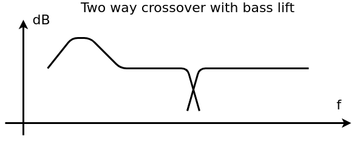
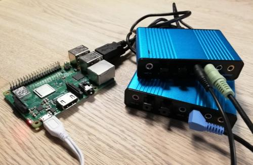

# Two Way Crossover

A minimalist project about using a computer and a sound card to quickly produce a two way crossover filter for an analog audio signal chain. It is intended to be used for anything from quick tests and experiments to be installed on e.g. a Raspberry Pi Zero and get permanently embedded in a diy speaker setup.

This projects primary goal is simplicity of use. There are a lot of super nice projects that does the same but they all seem to delivery more features (and design quality) at the expense of added complexity in getting things up and running. And probably a fair guess is that a lot of potential users for a project like this have little or limited experience with linux. Unfortunately even this project still requires at least a little experience with audio on a linux machine.

This is not a HiFi project. It happily decreases the signal to noise ratio by letting the signal pass a couple of 16 bit converters in a sound card most likely chosen from its price tag, just to be filtered by filters with allowed ripple in the pass bands. In other words it probably looks like a lot of consumer audio does these days and chances are that it will do just fine for a lot of diy audio projects.

Implementing the design requirements in software rather than hardware means that just about everything is suddenly infinitely tweakable. Currently the default behavior is tailored towards small and size constrained closed enclosures and it incorporates a bass lift intended to work below the natural low corner frequency to get 'an extra octave' in the low end. (*)

(*) This of course come at a cost. A relatively lot of power might be delivered in the woofer which is basically asked to play in a range where it by nature can't really produce sound. So at least one effect of this is that the max power rating and max cone excursion gets exhausted at a lower apparent sound level than without the boost. So it is a solution for quality rather than quantity. Typically a compensation filter like this for a closed box would be a 6 dB/oct filter but right now its just a couple of bands from a 10 band equalizer.

Please be aware that this project currently is to be considered slightly unstable. It is known to seamleesly introduce  changes and break things at the same time. The status 'works' might be read as 'works or once did'.

| computer 	| status                                  	|
|----------	|-----------------------------------------	|
| x86      	| works except for 'stereo_40' (*)         |
| RPI 3B+  	| works                                   	|
| RPI 1B  	| works (*)                 |
| Zero     	| not tested (same but faster cpu as 1B+) 	|

(*) - see performance appendix further down

## Get started

1. Fire up a linux computer with a sound card
2. Install alsa, gstreamer and python 3.6+ if they are not already available
3. Clone the software
4. Run the python script

You now have a single channel digital-analog crossover filter thanks to gstreamer. Default is mono operation and a crossover at 2kHz (8'th order 0.25dB ripple Chebyshew) and a 6 dB boost at 59 Hz. Bass in left channel and treble in right channel.

## Get started notes

1. Only Arch Linux have been tested but there is no reason to believe that other distroes will misbehave. If using a USB sound card then get one with a real line-in input, assuming that the setup should be based on line signals in the first place. The average headset dongles have mic-in and can be used for testing but most doesn't really belong in a setup like this.
2. Fire and forget install lines. (Python stuff must be 3.6 or newer)

    Arch : git gstreamer gst-plugins-good gst-plugins-base alsa alsa-tools alsa-utils gst-python

Brings in about 480MByte of storage use on a fresh Arch install.

3. Make a git clone
4. Execute

    $python two_way_crossover.py

Woofer signal will be in left output, tweeter in right output. The script uses the default alsa device, alternatively run 'aplay -l' to get the correct Alsa device id and modify the script accordingly.

There is a template for a systemd service file in ./systemd that might be of help in case the script should start at boot time.

# Get tweaking

The overall configuration can be set to 'left', 'right', 'mono', 'stereo' or 'stereo_40'. The plain 'stereo' mode is using two separate soundcards for left and right and the 'stereo_40' mode is using two outputs on a single 5.1 or 7.1 soundcard for left and right. 'stereo_40' might need some tweaking of the gstreamer pipeline. The current values matches a logilink UA0099 soundcard where channel 5 & 6 plays in the 'surround' channel on the UA0099. Whatever the mode gstreamer/Alsa seems to get it right and there is no need to e.g. use surround profiles in .asoundrc.

The mode and the central adjustable parameters are found in the configuration file two_way_crossover.json. The configuration file is automatically reloaded and applied when modified. There should be no reason to restart the python script unless the script itself is modified.

Here is an image of what a 'stereo' crossover filter with a RPI 3B+ could look like. Since it is using two 5.1 soundcards the picture was taken before there was a 'stereo_40' mode which could have driven a stereo setup with just a single 5.1 soundcard...

## Loudness and protection

There are some very experimental implementations of a loudness control and a woofer protection. Unless you intend to dig into the script and work on the implementations the advise is to leave them both off for now. Neither have been used in real life which certainly will bring adjustments.

### Loudness

The loudness decreases the amount of basslift as the signal increases (so it actually isn't a real loudness from just fiddling with the basslift). Ideally a loudness control would track the current volume setting/sound pressure level but since we have no idea what that is it will have to monitor the actual signal level instead. This is problematic since the loudness will now adjust according to the ups and downs in the signal itself which is by all accounts a terrible idea. So it might not be for every ones taste. The current setup tries to be very gentle and while that sounds nice it also means that it adapts rather slowly in the situation where the volume is decreased while it at the same time will start adjusting the loudness level in the quiet periods say between songs.

### Woofer protect

This uses signal levels reported by a level element for decreasing the bass lift whenever the signal level exceed the absolute value _protection_threshold_. This is done in an attempt to protect the woofer from operating above its maximum cone excursion or overheat. It measures the level right before the output so it will depend both on the input signal and any gain in the bass lift section itself. Since the level where to start protecting depends on the gain in the power amplifier and offcourse the speaker unit itself trial and error will have to be used to find the correct value for the _protection_threshold_ level.

# Caveats

Running alongside pulseaudio has not been tried so it is not known if that might be problematic. It might be that the script could have trouble connecting to Alsa if there is some device locking going on ?

Feel free to use the issue tracker for rants and questions and pull requests for fixes and any nice stuff.

# Appendix : USB/Audio Performance

**x86**

Outputting 4 channels to a single 5.1 soundcard in 'stereo_40' mode doesn't seem to work on x86 like it does for the raspberry pi boards, the current channelmasks seems to fail. This havent been investigated further.

**RPI**

Performance issues ranges from pure noise output (RPI 1B in standard configuration) to occasional ticks. Following is an accumulated list of tweaks tried. Most likely one or more could be removed without having any noticable effect and the killer tweak might still waiting for someone to find it. 

The complete list is what is used for the RPI 1B including the script [rpi_1B_boot.sh](systemd/rpi_1B_boot.sh) in ./systemd.

**1** Increase the alsasink buffertime from the default 10000 us. RPI 1B currently uses 100000 which means that there is a noticable audio latency where the RPI 3B+ can run with as low as 100 us.

**2** Overclock to the limit and maybe beyond in /boot/config.txt. This is for the RPI 1B.

    force_turbo=1
    over_voltage=4
    arm_freq=900
    core_freq=500
    sdram_freq=400

**3** Add dwc_otg.speed=1 to /boot/cmdline.txt. Forces USB to run at a fixed 12Mb/sec.

**4** Turn off systemd-journald writing to disk. Storage=none in /etc/systemd/journald.conf. Disable haveged now we are at it with systemctl disable haveged.

**5** Run the script with realtime priority. 

\# chrt --rr 99 /usr/bin/python <path\>/two_way_crossover.py

# Links

[Pulseaudio Crossover Rack](https://t-5.eu/hp/Software/Pulseaudio%20Crossover%20Rack)

